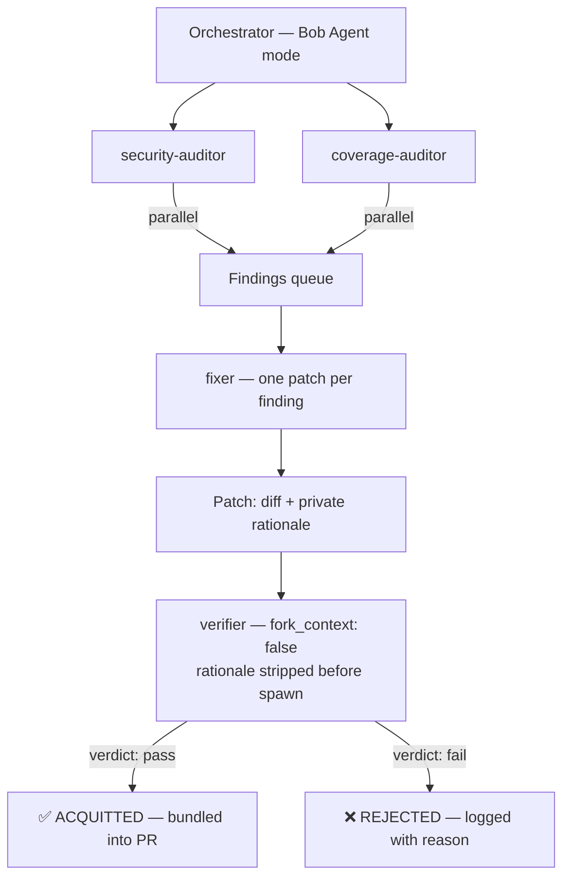

# PatchCourt ⚖️

**AI auto-fix, but with a built-in adversary.**

The model that writes a patch also grades its own homework — so teams end up manually re-reviewing every AI fix anyway, which kills the time savings. PatchCourt fixes this with structural separation: a Verifier subagent that has *never* seen the Fixer's reasoning independently proves whether a patch actually works before it ships.

Built for the **IBM Bob 2.0 Hackathon** (Sept 2026).

---

## The problem

When an LLM proposes a fix, its chain-of-thought is already invested in that fix being correct. Asking the same model — in the same context window — to verify it isn't verification. It's confirmation bias with an API.

Every engineering team that pilots AI code review ends up adding a rule: *"someone still has to read every AI-authored change before it merges."* The time savings disappear.

PatchCourt solves this with the same principle that works in human review: **the person who writes the code cannot be the one who approves it.**

---

## How it works

Four isolated Bob subagents, each with a scoped role:



| Role | Type | What it does | What it can't do |
|---|---|---|---|
| **security-auditor** | `general` · parallel | Scans for eval, injection, bounds issues | Write files |
| **coverage-auditor** | `general` · parallel | Finds untested branches and edge cases | Write files |
| **fixer** | `general` · file-scoped | Drafts one patch per finding | Touch any file except the named one |
| **verifier** | `explore` · `fork_context: false` | Judges diff + test output | See fixer's rationale. Ever. |

**The isolation that makes this real, not theatrical:**  
The Verifier is spawned with `fork_context: false` and receives only `{finding, diff, test_before, test_after}`. The `rationale` field is stripped by the orchestrator before the subagent is spawned — it's architecturally absent, not just omitted by convention.

---

## Results — this run

| Metric | Value |
|---|---|
| Findings | 17 total (5 security · 12 coverage) |
| Selected for patching | 3 high-severity |
| Patches proposed | 3 |
| Acquitted | **3** (avg verifier confidence: 0.98) |
| Rejected | 0 |
| Tests | 7/10 → **10/10** |
| Pipeline wall clock | ~5 min |
| Estimated manual review saved | ~40 min |

Full machine-readable record: [`results/run-2025-01-15T14-32-00.json`](results/run-2025-01-15T14-32-00.json)  
PR description with findings breakdown: [`PR_DESCRIPTION.md`](PR_DESCRIPTION.md)  
Live dashboard: [`dashboard.html`](dashboard.html)

---

## Demo findings

Three Python data structures, each seeded with one real issue:

| File | Issue | Verifier verdict |
|---|---|---|
| `src/union_find.py` | `find()` had no bounds check — negative indices silently aliased, out-of-range raised `IndexError` not `ValueError` | ✅ ACQUITTED (0.98) |
| `src/lru_cache.py` | `put()` evicted `head.next` (MRU) instead of `tail.prev` (LRU) — wrong entry silently dropped under load | ✅ ACQUITTED (0.99) |
| `src/hash_map.py` | `compute_key()` called `eval()` on caller-supplied input — arbitrary code execution, no failing test | ✅ ACQUITTED (0.98) |

> **Why `hash_map.py` has no failing test:** `eval()` is a security issue, not a logic bug. No test catches it because no test was written to trigger arbitrary code execution. This is exactly why the security-auditor runs as a separate track from the coverage-auditor.

---

## Reproduce it

```bash
git clone https://github.com/asmit25805/Patchcourt
cd Patchcourt
pip install -r requirements.txt
python -m pytest -v        # 10 passed
```

Then open the folder in Bob IDE to re-run the pipeline.

---

## Use it on your own repo

PatchCourt is a portable Bob configuration. The pipeline itself lives in `.bob/` — copy it into any project and it works.

### 1. Copy the config

```
your-repo/
├── .bob/
│   ├── custom_modes.yaml        ← 4 subagent role definitions (copy as-is)
│   ├── rules.md                 ← 10 governance rules Bob reads every session
│   └── skills/
│       ├── security-audit.md    ← reusable audit skill
│       └── verify-patch.md      ← reusable verify skill
├── .bobignore                   ← keeps Bob focused on source files only
└── AGENTS.md                    ← update with your repo's context
```

### 2. Update two things for your codebase

**`AGENTS.md`** — replace the repo description with your own:
```markdown
## Repo
<your project name> — <what it does>

## Commands
python -m pytest -v    # or: npm test / go test ./... / cargo test
```

**`.bob/custom_modes.yaml` line 58** — change the `fileRegex` to match your source:
```yaml
# Python:     "src/.*\\.py$"
# TypeScript: "src/.*\\.ts$"
# Go:         ".*\\.go$"
# Rust:       "src/.*\\.rs$"
```

### 3. Open your repo in Bob IDE and send this prompt

```
Run PatchCourt on @src/<your-files>

Spawn two auditor subagents in parallel:
- Security auditor: scan for eval/exec, unvalidated input, injection vectors,
  missing bounds checks. Return JSON: [{id, type:"security", severity, file,
  line, description, evidence}]
- Coverage auditor: scan for untested branches, missing edge cases, boundary
  values. Same schema, type:"test-coverage".

For each finding: Fixer subagent (general, writes only the named file).
Returns: {finding_id, diff, rationale}

I'll run tests and paste output. Verifier subagent (explore, fork_context:false)
receives only {finding, diff, test_before, test_after} — never the rationale.

Write results to results/run-<timestamp>.json
```

### 4. The one manual step

After each Fixer patch, run your test suite and paste the output back:

```bash
python -m pytest -v     # paste this output back to Bob as test_after
```

Bob passes it to the Verifier. The Verifier returns a structured verdict with concrete reasoning — not an opinion. You approve or reject based on that.

### What you get out

- **`results/run-<timestamp>.json`** — every finding, patch, and verdict in machine-readable JSON. Pipe it into Slack, a ticket tracker, or CI.
- **`PR_DESCRIPTION.md`** — ready-to-paste PR body listing which findings passed and which were rejected with reasons.
- **`dashboard.html`** — open in any browser. No server, no build step.

### Works with any language

The governance rules, isolation mechanism, and data contracts are completely language-agnostic. The only change per language is the `fileRegex` in `custom_modes.yaml` and the test command in `AGENTS.md`.

**The one hard requirement:** IBM Bob IDE. The `spawn_subagent`, `fork_context: false`, and custom modes are Bob-native features. The pipeline transfers to any tool that supports isolated agent contexts with the same primitives.

---

## Repo structure

```
patchcourt/
├── src/                         # Source files (patched)
│   ├── hash_map.py
│   ├── lru_cache.py
│   └── union_find.py
├── tests/                       # Test suite (10/10 passing)
├── results/                     # Run output JSON
├── bob_sessions/                # Bob task session screenshots
├── .bob/
│   ├── custom_modes.yaml        # 4 subagent mode definitions
│   ├── rules.md                 # 10 governance rules
│   └── skills/                  # Reusable audit + verify skills
├── AGENTS.md                    # Repo context + governance rule
├── dashboard.html               # Run visualiser (self-contained)
├── PR_DESCRIPTION.md            # Generated PR body
├── SUBMISSION_problem_statement.md
└── SUBMISSION_bob_usage_statement.md
```

---

## Key files

| File | Purpose |
|---|---|
| [`AGENTS.md`](AGENTS.md) | What Bob reads at the start of every session — governance rule is here |
| [`.bob/custom_modes.yaml`](.bob/custom_modes.yaml) | The 4 subagent role definitions with exact tool-group permissions |
| [`.bob/rules.md`](.bob/rules.md) | 10 rules Bob cannot deviate from (isolation, commit format, rollback policy) |
| [`.bob/skills/security-audit.md`](.bob/skills/security-audit.md) | Reusable security scan skill |
| [`.bob/skills/verify-patch.md`](.bob/skills/verify-patch.md) | Reusable patch verification skill |
| [`dashboard.html`](dashboard.html) | Self-contained run dashboard — open directly in browser |
| [`results/run-2025-01-15T14-32-00.json`](results/run-2025-01-15T14-32-00.json) | Full machine-readable pipeline run record |
